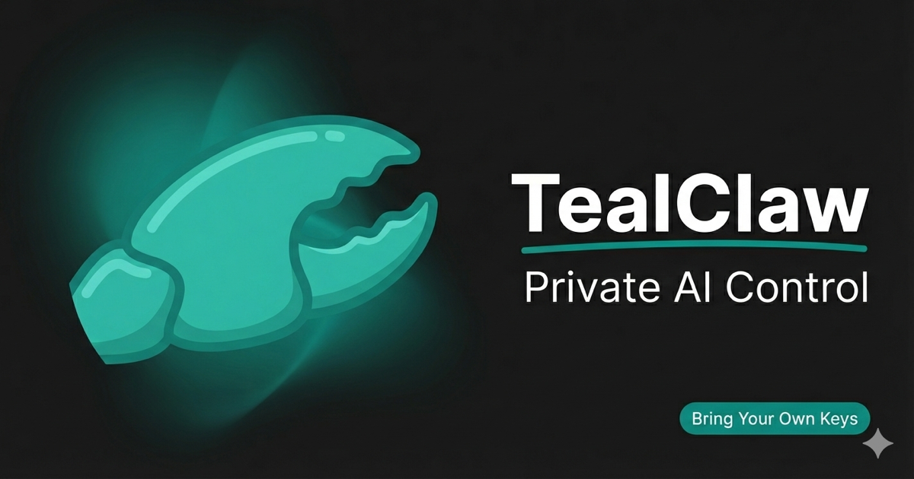

# TealClaw



**Private AI chat with voice.** One file. No server. Your keys never leave your browser.

**[tealclaw.ai](https://tealclaw.ai)**

---

## Get Started in 30 Seconds

1. Open **[tealclaw.ai](https://tealclaw.ai)**
2. Grab a free key from [console.groq.com/keys](https://console.groq.com/keys)
3. Paste it and start talking

That's it. One key gives you chat, voice, vision, image generation, and deep research.

---

## What You Get

**Voice Chat** — Hold to speak, get spoken replies. Six voice personas with distinct personalities: Trey (hype), Axel (hacker), Dean (professional), Haven (chill), Vera (nerd), Diane (executive). Powered by Groq Whisper + Orpheus TTS.

**Deep Research** — Type `/research` and get a full sourced report. `/deepresearch` goes deeper with multi-tool analysis.

**Image Generation** — `/imagine` creates images via Google Gemini. Attach a photo and say "make this a watercolor" for image-to-image editing.

**The Claw** — Hand gesture control via your camera. Show The Claw to start voice capture. Lower your hand to send. Hands-free everything.

**Vision** — Snap from camera, paste, or drag files in. Multi-image support.

**GIF Reactions** — AI picks contextual GIFs that match your conversation. Draggable, resizable, and fun.

**110+ Settings** — Colors, fonts, layout, voice, persona, quick replies, scheduled messages, templates. Everything is customizable. AI agents can configure it all via JSON.

**Guest Links** — Create encrypted, scoped access links for anyone. AI security filter screens every message before it reaches your agent. Attack detection, automatic session blocking, and silent owner alerts built in.

**Obsidian Integration** — Save conversations and AI notes directly to your vault.

---

## Privacy First

TealClaw has **no backend**. The site is static files on Cloudflare Pages.

- Your browser talks directly to AI providers. No middleman. No proxy.
- All keys stored in your browser's `localStorage`. We literally cannot see them.
- No analytics, no cookies, no fingerprinting, no telemetry.
- Encrypted sharing uses AES-256-GCM with a separate passphrase.
- The entire app is one HTML file. View Source and read every line.

Full details: **[Security Philosophy](SECURITY.md)**

---

## Scoped Agent Access

TealClaw solves one of the hardest problems in AI: **letting other people use your agent without giving them the keys.**

Guest links create encrypted, scoped access points with a multi-layer AI security filter between the guest and your agent. No API keys exposed. No prompt injection. No unauthorized access.

**How it works:**

1. Owner creates a guest link with defined scope (allowed topics, presets, rate limits)
2. Guest unlocks with a passphrase and sees only preset conversation starters
3. Every message goes through a **Groq AI security filter** first — not to the agent
4. The filter screens for prompt injection, social engineering, and out-of-scope requests
5. When the request is ready, guest clicks **"Send to Bot"** — the filter summarizes the conversation and forwards a clean, scoped message to the agent inside a security envelope
6. If an attack is detected: session terminated, 1-hour block, and your agent is **silently notified** with instructions to alert you immediately

**What makes this different:**

- **Guests never talk to the agent directly** — every message is filtered and summarized first
- **The agent never sees raw guest input** — only a distilled, security-screened request
- **Attack detection is autonomous** — no owner intervention needed to block threats
- **Silent escalation** — your agent alerts you via the best available channel without tipping off the attacker
- **3-strike policy** — repeated out-of-scope attempts automatically trigger attack protocols
- **Zero server** — all of this runs client-side with your own Groq key

This is scoped agent access with defense in depth. Full technical details: **[Security Philosophy](SECURITY.md#guest-link-security-filter)**

---

## Commands

| Command | What It Does |
|---------|-------------|
| `/research query` | Sourced research report |
| `/deepresearch query` | Multi-tool deep analysis |
| `/imagine prompt` | Generate an image |
| `/photo` / `/capture` / `/takephoto` | Open camera, capture, and send photo for AI analysis |
| `/screenshot` / `/screen` / `/capture-screen` | Open screen picker, capture one frame, and send screenshot for AI analysis |
| `/voice` | Voice settings and personas |
| `/save` | Save to Obsidian |
| `/template` | Browse style templates |
| `/share` | Encrypted config link |
| `/session create` | Time-limited guest access |
| `/profile save name` | Save/load config profiles |
| `/help` | All commands |

Works by voice too — just say "research quantum physics" or "imagine a sunset over mars".

### Agent Camera Routing (OpenClaw mode)
- Use `/photo` (or `/capture` / `/takephoto`) for one-off camera snapshots, routed through `camera.capture`.
- Use `/screenshot` (or `/screen` / `/capture-screen`) for display captures, routed through `screen.capture`. Prefer screenshot for UI/app/website debugging; prefer photo for real-world scenes.
- Facing guidance: `environment` for rooms/objects/scenes, `user` for selfie/face checks.
- Use Overwatch/watch flows for ongoing monitoring; use photo-log when the user wants archived reviewable captures.
- Proto-BOLO is a watchlist-matching target workflow (v3), not general image Q&A.
- Always confirm consent/authority before any camera capture or monitoring.
- New setting (default ON): **Inline agent capture consent**. When an agent sends `camera.capture` or `screen.capture`, TealClaw shows lightweight prompts (photo: "Take photo / Cancel", screenshot: "Take screenshot / Cancel"). Screenshot capture stops screen-share tracks immediately after one frame.

---

## Connect Your Own Agent

TealClaw connects to **[OpenClaw](https://github.com/openclaw/openclaw)** gateways via WebSocket for full agent mode — shared context across Telegram, Discord, Signal, and more.

```
Your Browser ←→ Cloudflare Tunnel ←→ OpenClaw Gateway ←→ Your AI Agent
```

Paste a gateway URL + token, or let your agent generate a one-click connection link.

**Phone note:** If your gateway doesn’t respond to browser CORS preflight (OPTIONS) on `/v1/chat/completions`, use the Worker shim guide: https://tealclaw.ai/docs/openclaw-cloudflare-worker.txt

**Device Pairing:** TealClaw uses Ed25519 device authentication on every connection. The first time you connect to a gateway through a Cloudflare Tunnel, the gateway operator must approve your device (one-time). Local connections auto-approve. See [llms.txt](https://tealclaw.ai/llms.txt) for details.

---

## For AI Agents

Build tools that configure TealClaw automatically:

- **[tealclaw.ai/llms.txt](https://tealclaw.ai/llms.txt)** — Full skill guide (raw text, agent-ready)
- **[tealclaw.ai/llms.html](https://tealclaw.ai/llms.html)** — Human-readable version
- **[SKILL.md](SKILL.md)** — tc-action protocol reference

Agents read the skill guide, emit `tc-action` JSON blocks, and TealClaw executes them — config changes, commands, navigation, file generation, and more.

---

## Stack

Single HTML file. No build step. No framework. No dependencies.

- PWA with service worker for offline support
- CSS custom properties for theming
- Hosted on Cloudflare Pages

```bash
# Run locally
npx serve .
```

---

## Support

Made by **Snail** — [YouTube](https://www.youtube.com/@RealSnail3D) / [MakerWorld](https://makerworld.com/en/@Snail)

[](https://buymeacoffee.com/snail3d)

---

<p align="center">
  <a href="https://tealclaw.ai">tealclaw.ai</a>
</p>
