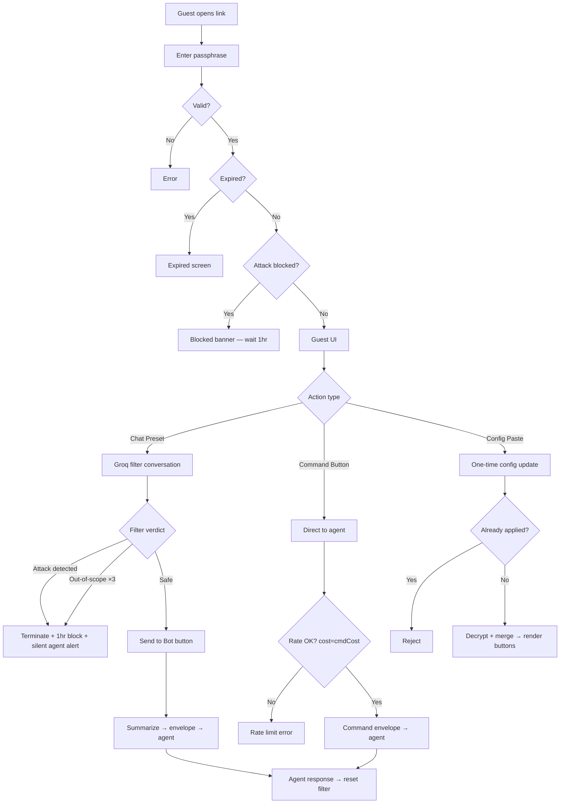

# Security Philosophy

TealClaw is built on one principle: **your data is yours**.

## Architecture

TealClaw is a static single-page application. One HTML file. No server. No database. No backend logic. The domain `tealclaw.ai` serves static files via Cloudflare Pages — it cannot execute code, store data, or intercept requests.

```
Your Browser ←→ AI Provider (Groq)
Your Browser ←→ Groq Orpheus (text-to-speech)
Your Browser ←→ Google Gemini (image generation)
Your Browser ←→ Klipy (GIF reactions, via server proxy)
```

Every API call goes directly from your browser to the provider. TealClaw is not in the middle.

## Key Storage

All API keys and configuration are stored in your browser's `localStorage`. This means:

- Keys exist only on your device
- Keys are never transmitted to tealclaw.ai (there is no server to transmit them to)
- Keys persist across sessions until you clear them
- Each browser/device has its own independent config
- Clearing browser data or running "Clear All" in settings wipes everything

## API Key Protection

- **Gemini API key** is sent via the `x-goog-api-key` HTTP header, never as a URL query parameter. This keeps it out of server logs, browser history, and network inspection tools.
- **Referrer policy** is set to `no-referrer` — your API keys and page URLs are never leaked via the Referer header to third-party services.
- **Blocked config keys** — AI agents cannot modify sensitive fields (`aiKey`, `whisperKey`, `gwToken`, `gwUrl`, `mode`, `pinCode`, `pinHash`, `tgToken`, `tgChatId`, `imageGenKey`, `webhookUrl`, `webhookEvents`, `customCSS`) through tc-action config blocks. Only the user can set these.
- **Config redaction** — When the AI requests your current config (via `request-config` tc-action), sensitive keys are replaced with `keySet: true` flags. The AI knows a key is configured but never sees the actual value.

## Agent Action Confirmation

AI agents can trigger actions via `tc-action` JSON blocks. Sensitive actions require explicit user approval before executing:

- **Commands** — Running slash commands (`/research`, `/imagine`, etc.)
- **Style changes** — Modifying CSS variables
- **Save to Obsidian** — Writing notes to your vault
- **Camera snapshot** — Taking a photo via the device camera
- **Guest link creation** — Creating access links (which embed tokens)
- **Surveillance start** — Activating camera detection

Each confirmation shows the action details and requires the user to tap "Allow" or "Deny". The AI cannot bypass these gates.

## HTML and CSS Sanitization

- **tc-action HTML** (`bubble` type) is sanitized to strip dangerous elements — `<script>`, `<iframe>`, event handlers (`onclick`, `onerror`, etc.), `javascript:` URLs, and data URIs are all removed before rendering.
- **CSS variables** set by AI agents are sanitized — `url()`, `expression()`, and `-moz-binding` are stripped to prevent CSS injection attacks.
- **Custom CSS** (`customCSS` config) is blocked from AI modification entirely.

## Config Sharing

TealClaw supports sharing configurations via URL:

```
https://tealclaw.ai/#config=BASE64_JSON
```

The `#config=` portion is a **URL fragment** (hash). By design, URL fragments are never sent to the server in HTTP requests. The browser processes the fragment client-side, imports the config, and immediately clears it from the URL bar.

### Encrypted Share Links

When sharing configs that contain API keys, use the `/share` command. This creates an AES-256-GCM encrypted link:

```
https://tealclaw.ai/#config=enc:ENCRYPTED_BLOB
```

**How it works:**

1. Your config JSON is encrypted using AES-256-GCM via the Web Crypto API
2. A **random salt** is generated for each encryption (stored alongside the ciphertext)
3. The encryption key is derived from an 8-character alphanumeric passphrase using PBKDF2 (100,000 iterations, SHA-256, random salt)
4. A random 12-byte IV is generated for each encryption
5. The passphrase is **never included in the URL**

**To decrypt:** the recipient must enter the passphrase separately. Without it, the encrypted blob is computationally infeasible to crack.

**Passphrase strength:** 8 alphanumeric characters (a-z, A-Z, 0-9) = 62^8 = ~218 trillion combinations. Combined with PBKDF2's 100k iterations and a random salt, brute-force attacks are impractical.

**Best practice:** Share the link and passphrase through different channels (e.g., link via chat, passphrase via voice or text message).

### Guest Links

Guest links create limited-access versions of TealClaw for other people. Security features:

- **Encrypted payload** — Guest link data is AES-256-GCM encrypted with its own passphrase
- **Rate limiting** — Configurable messages-per-hour limit per guest (consumed only on bot sends, not filter chat)
- **Max message length** — 100 characters per filter message prevents prompt stuffing
- **Expiration** — Links auto-expire after 7d, 30d, 90d, or 1y
- **Revocable** — Owner can disable any guest link at any time
- **Idle re-authentication** — Guests are automatically locked out after inactivity and must re-enter the passphrase
- **Passphrase never sent to AI** — When the AI creates a guest link via tc-action, the passphrase and URL are not included in the result sent back to the model

### Guest Link Security Filter

Guest links include a **Groq-powered AI security filter** that screens all guest input before it reaches the agent. This is scoped agent access with defense in depth — guests never talk directly to the agent.

**How it works:**



**Scoped input:** Guests can only initiate conversations by clicking owner-defined preset buttons. Free text input (capped at 100 characters) is only available after the first preset click, and only for follow-up conversation with the filter — never sent directly to the agent.

**The filter watches for:**

1. **Prompt injection** — Attempts to override instructions, extract system prompts, reveal API keys, impersonate the owner, or manipulate the filter into ignoring its rules
2. **Social engineering** — Attempts to trick the system into revealing internal information, escalating privileges, or bypassing security
3. **Out-of-scope probing** — Requests outside the owner-defined allowed topics (3 out-of-scope attempts = automatic attack escalation)

**When an attack is detected:**

1. The guest session is **immediately terminated** and **blocked for 1 hour** (persisted in sessionStorage)
2. All inputs are disabled — the guest sees "Session Terminated" with no details about what triggered it
3. A **silent security alert** is sent to the agent in the background containing:
   - Guest link ID, guest name, timestamp
   - A clinical threat assessment describing the **category** of attack (never the attacker's actual language)
   - Instructions to alert the primary account holder by the most reliable means available (SMS > email > Telegram > queued alert)
   - Recommendation to review and revoke the guest link
4. The agent processes this alert without responding in chat — the guest never sees it

**Security envelope:** When a message passes the filter, it reaches the agent wrapped in a security envelope that includes guest identity, owner instructions, allowed scope, and explicit instructions to never include API keys, passwords, tokens, or credentials in the response.

**Defense in depth layers:**

| Layer | Protection |
|-------|-----------|
| Preset-only initiation | Guests can't type arbitrary first messages |
| 100 char message limit | Prevents prompt stuffing in follow-ups |
| AI security filter | Screens for injection, social engineering, scope violations |
| 3-strike escalation | Repeated out-of-scope = automatic attack alert |
| 1-hour session block | Prevents retry after detection |
| Silent agent notification | Owner alerted without tipping off attacker |
| Security envelope | Agent instructed to protect credentials |
| Rate limiting (bot sends) | Limits actual agent interactions per hour |
| Summarization | Raw guest text never reaches agent — only a distilled request |
| Owner-defined commands | Trusted text bypasses filter — owner authored, not guest |
| Higher command cost | Commands consume 10 tokens per fire vs 1 for chat sends |
| One-time config update | Supplemental config can only be applied once per session |
| QR overflow split | Large payloads split into core link + separate config paste |
| Legacy fallback | Old links without filter still work via sandwich prompt |

## PIN Code Lock

TealClaw supports an optional PIN code that locks the chat interface:

- PIN is hashed before storage (not stored in plaintext)
- Incorrect attempts show error feedback
- PIN lock activates on page load and after idle timeout
- Protects against casual access on shared or unlocked devices

## What We Don't Do

- **No analytics cookies.** No Google Analytics, no Facebook Pixel, no tracking scripts.
- **No fingerprinting.** We don't collect device info, IP addresses, or browser characteristics.
- **No telemetry.** No usage data, error reports, or behavioral tracking is sent anywhere.
- **No account system.** There is nothing to sign up for. No email, no password, no profile.
- **No server-side processing.** The domain serves static files. Period.

## What Third Parties See

When you use TealClaw, your AI provider receives your messages and API key — that's the nature of using their API. TealClaw doesn't add any additional data to these requests beyond what the provider requires.

| Service | What They See | When |
|---------|--------------|------|
| AI Provider (Groq) | Your messages + API key | Every chat message |
| Groq Whisper | Your voice audio + API key | When you use voice input |
| Groq Orpheus | AI response text + API key | When TTS plays |
| Google Gemini | Image prompt + API key | When you use `/imagine` |
| Klipy (via server proxy) | GIF search queries | When GIF reactions trigger |
| Cloudflare Pages | Standard HTTP logs (IP, page request) | On page load only |

TealClaw adds no tracking parameters, no user IDs, and no metadata to any of these requests.

## Developer Safety Checks (Repo)

To reduce the chance of accidentally committing secrets, this repo includes a lightweight scanner:

- Run: `node scripts/security-scan.mjs`
- It scans **tracked text files** for common key/token formats (best-effort).
- Treat any hit as a stop-the-line event: rotate/revoke the credential and purge it from git history if needed.

## Auditability

TealClaw is fully open source and intentionally simple to audit:

- **One HTML file.** All CSS and JavaScript are inline. No bundling, no minification, no build step.
- **No bundled dependencies.** Zero npm packages. Optional CDN libraries are loaded on demand only when their feature is used:
  - **QRCode.js** (jsdelivr) — QR code generation via `/qr`
  - **KaTeX** (jsdelivr) — LaTeX math rendering when `latexEnabled` is on
  - **Mermaid** (jsdelivr) — diagram rendering when AI responses contain mermaid blocks
  - **pdf.js** (cdnjs) — PDF file preview when attaching PDFs
  - **Mammoth** (cdnjs) — Word document preview when attaching .docx files
  - **MediaPipe Hands** (jsdelivr) — gesture control when camera gesture mode is enabled
  - **hls.js** (jsdelivr) — HLS video streaming for tc-action video feeds
  - **Chart.js** (jsdelivr) — usage statistics charts in `stats.html`
- **View Source works.** Right-click the page and read every line of code that runs on your device.

## Reporting Security Issues

If you find a security vulnerability, please report it responsibly:

- Open an issue at [github.com/Snail3D/tealclaw/issues](https://github.com/Snail3D/tealclaw/issues)
- Or contact Snail directly via [buymeacoffee.com/snail3d](https://buymeacoffee.com/snail3d)
